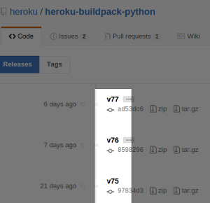

# Using a Specific Buildpack Version
While The Platform can detect and apply a buildpack automatically, Datica recommends that The Platform users pin their buildpacks to a specific version.

If the buildpack is not pinned, users run the risk that a buildpack update unexpectedly breaks their code.

## How do I pin the buildpack version?
The below procedure outlines how to pin the buildpack version for your application.

### 1. Set the BUILDPACK_URL environment variable
the Platform build procedure constructs the application based on automatically detecting the code type or reading in the `BUILDPACK_URL` environment variable.

Every buildpack release is tagged with a version number. You can view the releases on the Github page for each buildpacks. Below is the Python buildpack for example:

Navigate to the [Python Buildpack](https://github.com/heroku/heroku-buildpack-python) in a web browser. You'll see the Github page. Click on the `Releases` link as highlighted below:

This displays all of the buildpack releases as highlighted below.

Choose the release you want to pin. In our example, we'll choose `v68`. The buildpack URL will look like this:

`https://github.com/heroku/heroku-buildpack-python#v68`

Then set the URL. In this example, my environment name is `ProdEnv`:

`datica -E MyProdEnv vars set <service_name> -v BUILDPACK_URL="https://github.com/heroku/heroku-buildpack-python#v68"`

### 2. Rebuild Application
This change will only take effect on the next build of the application. Builds are triggered by commits to the code service.

### See also
* [Custom Buildpacks](/compliant-cloud/articles/buildpacks-custom)