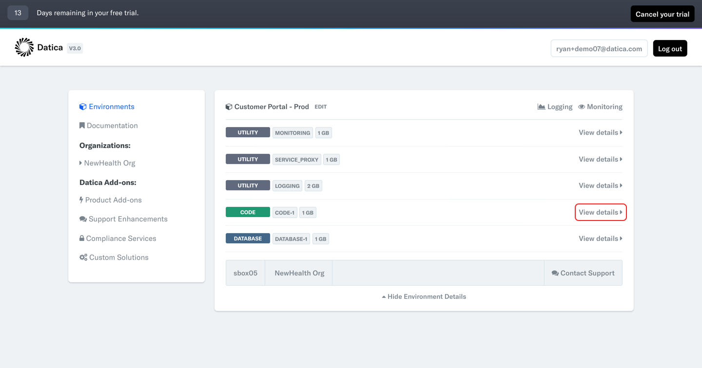
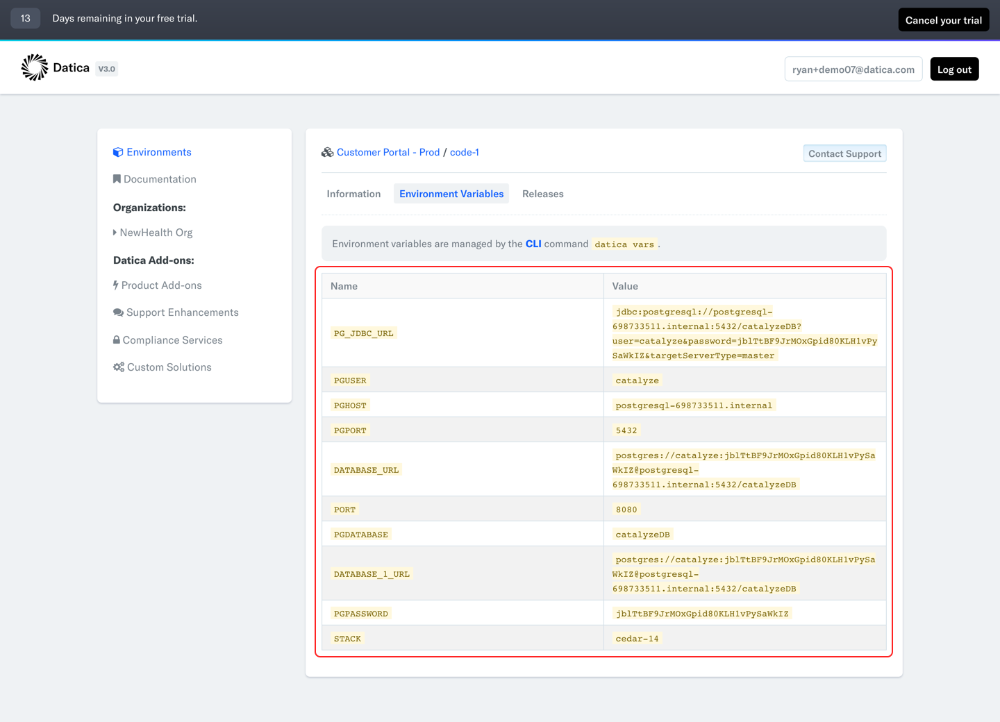

# Stratum Environment Variables

## How do Environment Variables Work?

Environment variables in Stratum are set or reset for a code service every time the service is ***built*** or ***redeployed***. These variables contain data that the code service can then consume during operation. Environment variables are specific to a single code service.

## Why Are Environment Variables Important?

Environment variables in Stratum allow an application to consume information that is not appropriate for storing in a code repository. That type of data could include:

* Third-Party Service Credentials
* Dynamic Configuration Settings

## Pre-Defined Environment Variables

Each new Stratum environment comes with several pre-defined environment variables that contain important information for your application to function and vary depending on the services in your environment. You can view these in the [Stratum Dashboard][https://stratum.catalyze.io] on your code service as soon as your environment is created by Catalyze. Examples include:

* DATABASE_URL
* S3_BUCKET
* REDIS_URL

Before you make your first code deploy, make sure that your application is ready to consume these values!

First, click on the "View Details" link for the code service.

The service's environment variables are located here:

## Setting Your Own Variables

To set your own environment variables checkout our environment variable management guide located [here](/stratum/articles/environment-variables-manage/).
