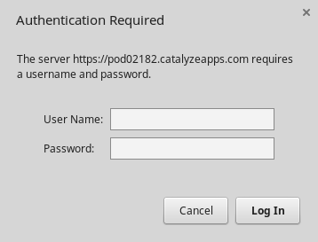
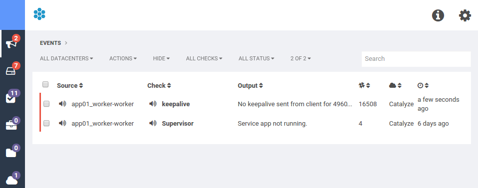

# Stratum Environment Monitoring

Every environment includes its own monitoring server that watches the services in the environment. Catalyze's monitoring solution is built on top of [Sensu](https://sensuapp.org/), and can be customized to fit specific customer needs.

## Accessing Monitoring

You can access an environment's monitoring service via the Catalyze-provided management URL.

`https://podxxxx.catalyzeapps.com/monitoring/`

You will see an authentication popup that looks like this:

Enter in the username and password for your Catalyze user account that has access to the specified environment.

Successful authentication will take you to an interface that looks like this:

The main page of the monitoring interface shows any monitoring checks in an error state. In the example picture, the `app01_worker-worker` service has two checks in an error state

The second tab down on the left side bar is the `clients` tab. This tab shows you the different services in your environment and their overall state.

If you click on an individual service, you can see the checks on that specific service, as shown below:

