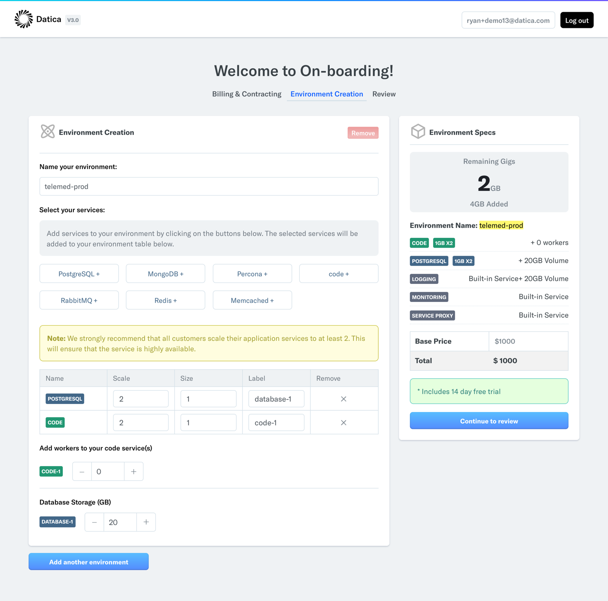
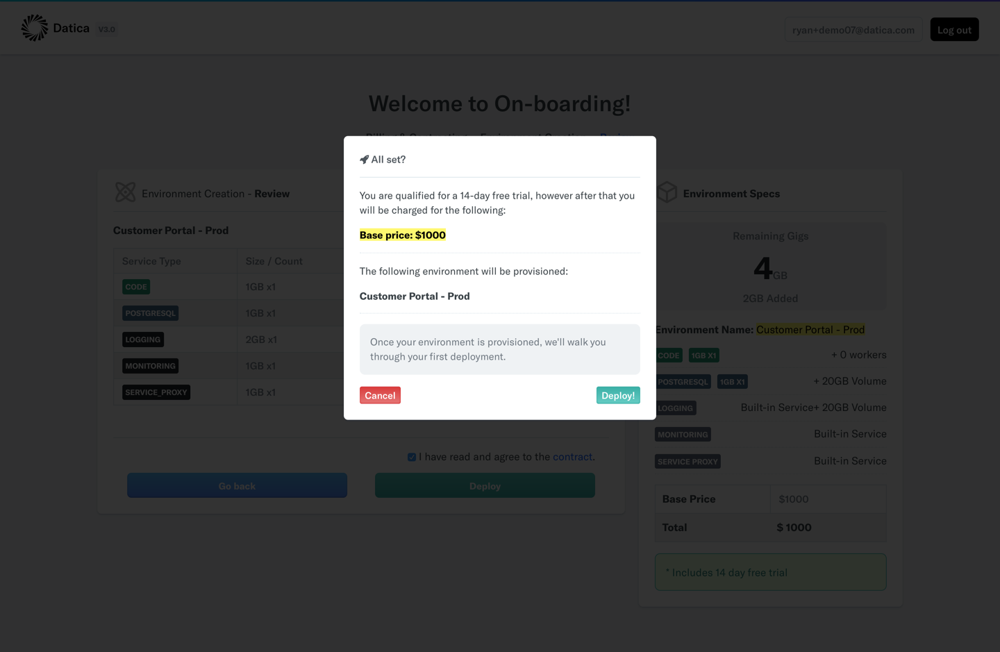
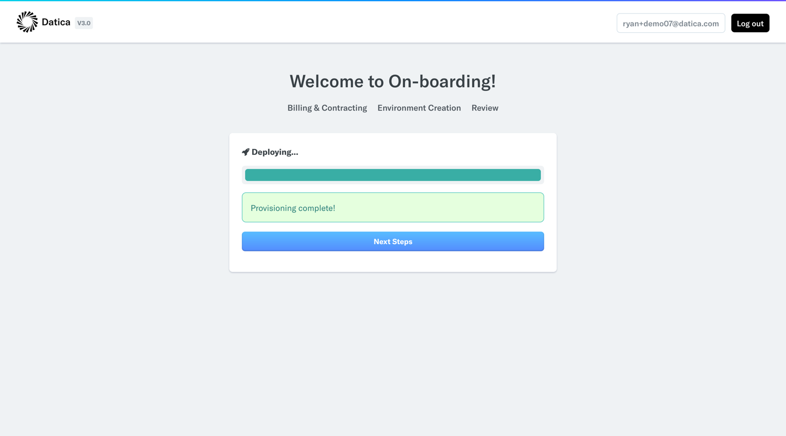

# On-boarding

As of August 15th 2017, Datica now offers customers the ability to completely on-board themselves with no support intervention. That means new customers can register for an account, input their billing details, spec out their application environment, provision, and deploy. We're even giving our Developer tier customers a 14-day free trial!

**Let's get started**

## Creating an account
First you'll need to register for a Datica Platform account in order to build a new environment. To register go [here](https://product.datica.com/compliant-cloud/register) and sign up with your email and a password of your choosing. Once you sign up you'll be sent an email confirmation. Click the link in that confirmation to make your registration process complete.

## Signing in
Now that you have an account and have confirmed your email you can sign in. Once you're signed in you should see an empty dashboard similar to the image below.

## Onboarding - Introduction
Next you should click on the button in the welcome message that says "Create an environment". Once you click that you'll be taken to on-boarding. In this first view we're explaining from a highlevel what is required to on-board, which includes:

- Filling out your billing details
- Specing out your applicaiton environment
- And then finally deploying your new application

## Onboarding - Billing & Organization Creation
Once you've read through the steps necessary to on-board and are ready to continue click the "Continue" button or "Billing" in the navigation.

Now that you're on the billing tab you'll need to create a new organization. In the dropdown under "Organization:" select "Create new organization". This will present an additional input for your "Organization Name:". We use these details for billing and contracting, so it's important you use the legal name of your entity here.

After you've typed out the name of your organization the next step is to choose your plan. Developer tier plans qualify for a 14-day free trial, so long as your environment fits inside of the available infrastructure (more on that later). Growth tier plans do not qualify for a 14 day free trial, however they do receive a number of other service-level benefits. For a  more in depth view of the difference between the two plans, please see our [pricing page](https://datica.com/pricing).

Once a plan is selected you'll have access to input your billing details in the form of a credit card. **Note:** We will never charge you without clearly indicating that we are doing so. We require a credit card up front to spec out an environment, however we will not charge you until that environment is provisioned. The one exception to that rule is when a customer's environment qualifies for a 14-day free trial, for which we will not charge you until the free trial is over.

## Onboarding - Environment Creation
Now we're cookin'! So you've created a new organization, have input your billing details, and now you're ready to create a new environment.

**The first step is to name your environment.** This name should be semantic and concise.

Once you have your name picked out **the next thing you'll want to do is select the services you need**. Datica's Platform abstracts away many of infrastructure complexities that you'd otherwise have to deal. What this means is that you'll get things like Load Balancing, Logging, Monitoring, Intrusion Detection, Backups, Disaster Recovery, and much more all out of the box. There is no additional configuration needed on Datica to make these features work.

As such, the only thing you need to do during this step is simply select the building blocks required to make your application run. See the image below as an example:

We call these building blocks services. Each environment comes with the following services automatically:

- **Logging:** This service is required for full HIPAA and HITRUST compliance. Datica utilizes an open source tool called Kibana to provide a logging dashboard for our customers.
- **Monitoring:** Another service required for full HIPAA and HITRUST compliance, monitoring is provided via an open source dashboard for Sensu called uchiwa.
- **Service proxy:** The Service Proxy is a special service in each environment that is responsible for routing traffic from the outside world into your environment’s network, to specific code services. This is configured using sites. The service proxy is the only service exposed outside of your environment’s network - all external (non-console, non-VPN) traffic goes through it and is proxied to other services.

**Note:** For your first Datica environment these services are covered under the base fee. For each additional environment they are billed at our standard services size fee ($100/month per 1GB of Ram).

Outside of our built-in utility services each customer has the opportunity to add a number of other services. These include databases, caches, messaging services, and code services alike. In the example above you'll see two services selected:

- PostgreSQL
- code

(See currently supported database versions [here](/compliant-cloud/articles/database-general/#sts=What versions of the supported databases does Datica use?).)

Both of these services are scaled to a size of 2. This is highly recommended. This will ensure your application is highly available.

You'll also notice that the size of these services is set to 1. This means that each service will have a dedicated 1GB of Ram. Let's look at the math on that…

A free trial comes with 6GB of Ram. In the example above there are two services. Each with a scale of 2 and a size of 1. That means we've used a total of 4GB out of our allotted 6. For quick reference see the environment creation sidebar. At the top you'll see your bucket of available ram. Now to be clear, you can add additional ram, however anything outside of the allotted 6GB will void the free trial.

**Code Services**
In the example above you'll see that we chose PostgreSQL for our database. This is an explicit selection that needs to be made given how the platform works. As far as code services are concerned you can ship any supported language with your application and The Platform will automatically detect the language and install the necessary dependencies. The Datica Platform supports the following languages:

- clojure
- erlang
- go
- gradle
- grails
- java
- multi
- nodejs
- php
- play
- python
- ruby
- scala

Alternatively users can create their own buildpacks and deploy them onto the platform. However, we cannot provide official support for such buildpacks. To learn more about custom buildpacks see [this article](/compliant-cloud/articles/buildpacks-custom/).

**Workers**
Customers also have the option to add workers to their code services. Workers are applications that are run in their own container, but do not bind to a port. Workers are typically used for asynchronous background processing and are sized just like other code services. To learn more about workers see [this article](/compliant-cloud/articles/concepts/workers/).

**Database Storage**
Each database comes preconfigured with 20GB of EBS volume. Customers have the option to scale this beyond 20 as they see fit. Additionally, Datica also provides compliant object storage. For more information on object storage see [this article](/compliant-cloud/articles/cloud-storage/) (we do not currently offer object storage configuration during on-boarding).

### Recapping Environment Creation
- Choose a semantic name for your environment (you'll be using it frequently in the CLI)
- Select the required services to run your application (likely some combination of code services and a database(s))
- Ensure your services have been scaled to 2 for high availability
- Add any required workers to your code services
- Add any additional capacity to your database storage

## Onboarding - Environment Creation Review
The end is in sight! Now that our environment has been spec'd out we need to review it. If everything looks good, go ahead and proceed to accepting the contract (we recommend you read the contract first as it contains our BAA) and clicking deploy. After doing that you should see a modal similar to the image below:

After reviewing the information you can go ahead and click "Deploy". If you qualify for a free trial you will not be charged. If you've gone outside of the 6GB limit for the Developer plan or have chosen the Growth plan you will be charged right away.

## Onboarding - Provisioning Progress
Now that you've clicked deploy you should see a progress bar. This means that the Platform is putting together your application's environment. This is a very quick process and shouldn't take more than 30 seconds (it will likely take less than 10 seconds). Once the provisioning process has completed you should see an on-screen success message like the image below:

